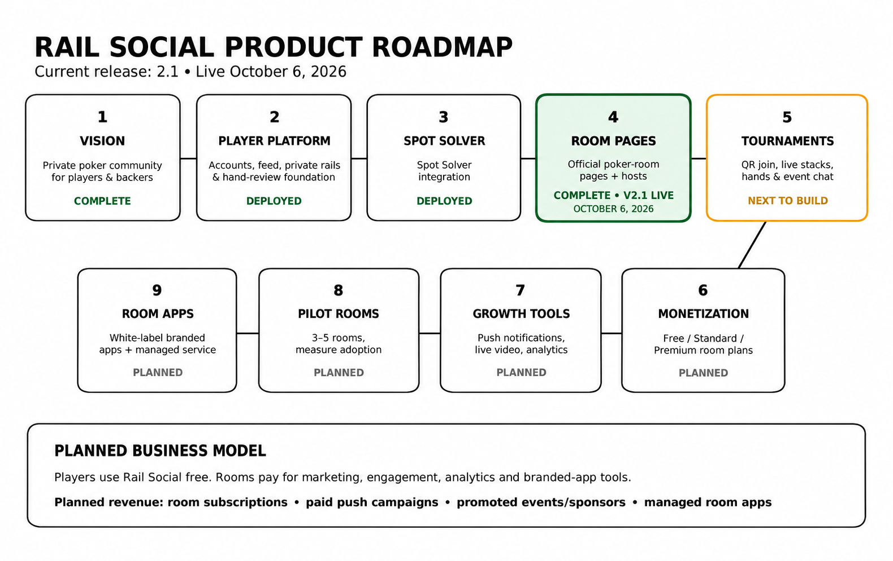

# Rail Social product roadmap

Updated October 6, 2026. **Current release: Rail Social 2.1, deployed to production.** Milestone 4, Room Pages, is complete. Milestone numbers below follow the original September 25 roadmap; they are not software version numbers.

Live site: https://railsupport.vercel.app

| Milestone | Scope | Status |
| --- | --- | --- |
| 1. Vision | Private poker community for players and backers | Complete |
| 2. Player platform | Accounts, feed, hand-review foundation; expanded in 2.0 with private rails, profiles, follows, photos, blocks, and odds | Complete and deployed |
| 3. Spot Solver integration | Embedded Spot Solver and hand import | Complete and deployed |
| **4. Room Pages** | **Official poker-room pages and hosts** | **Complete and deployed in 2.1 — October 6, 2026** |
| **5. Tournaments** | **QR join, live stacks, hands, and event chat** | **Next to build** |
| 6. Monetization | Free, Standard, and Premium room plans | Planned |
| 7. Growth tools | Push notifications, live video, and analytics | Planned |
| 8. Pilot rooms | Three to five rooms; measure adoption | Planned |
| 9. Room apps | White-label branded apps and managed service | Planned |

## Room Pages completed in 2.1

- Searchable directory and room profiles with shareable links.
- Draft and published pages, room follows, and host announcements.
- Approved room creators, owner controls, and co-host invitations with acceptance.
- Access checks that preserve private-rail separation and draft privacy.
- Production database migration and initial room-creator approval.

Published Room Pages currently require sign-in. Room follows do not yet send notifications. Paid plans, tournament communities, growth tools, pilot-room rollout, and branded apps remain future work.

The production build and signed-out checks passed. The full room permission flows passed local HTTP acceptance tests. Signed-in production room creation and browser visual checks remain manual follow-up checks; this does not change the completed deployment status.

## Business direction

Players use Rail Social free. The planned room business includes subscriptions, paid push campaigns, promoted events and sponsors, and managed branded room apps. These are future offerings, not services activated by the 2.1 release.

Source: the September 25, 2026 planning email, “RailSupport — Funding Visual, Roadmap & Room Tier Pricing,” and the verified October 6 production release. See [Room Pages release notes](ROOM-PAGES-2.1.md).
